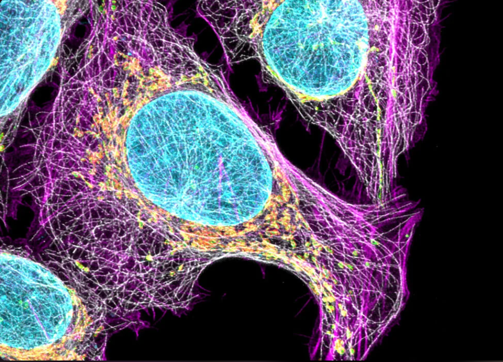
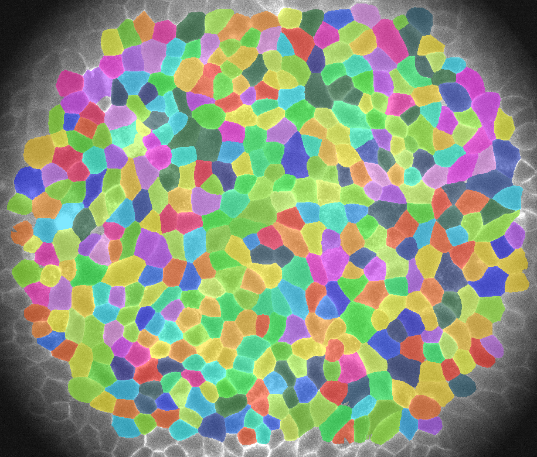
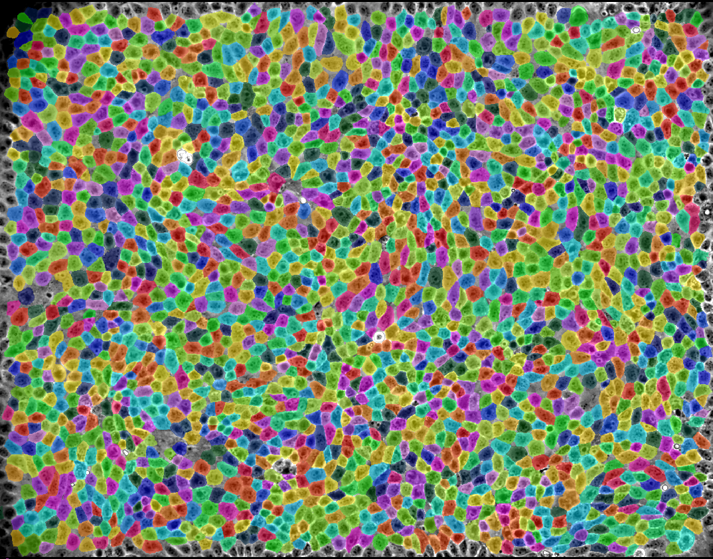

<!-- Improved compatibility of back to top link: See: https://github.com/othneildrew/Best-README-Template/pull/73 -->
<a name="readme-top"></a>


<!-- PROJECT LOGO -->
<br />
<div align="center">
  <a href="https://github.com/github_username/repo_name">
    
  </a>

<h3 align="center">CellSegmentationTracker</h3>

  <p align="center">
    A package intended to make cell segmentation, tracking and subsequent (mostly biophysical) statisticial analysis easy
    <br />
    <br />
    <a href="https://github.com/simonguld/CellSegmentationTracker.git">Report Bug</a>
    ·
    <a href="https://github.com/simonguld/CellSegmentationTracker.git">Request Feature</a>
  </p>
</div>


<!-- TABLE OF CONTENTS -->
<details>
  <summary>Table of Contents</summary>
  <ol>
    <li>
      <a href="#about-the-project">About The Project</a>
      <ul>
        <li><a href="#built-with">Built With</a></li>
      </ul>
    </li>
    <li>
      <a href="#getting-started">Getting Started</a>
      <ul>
        <li><a href="#prerequisites">Prerequisites</a></li>
        <li><a href="#installation">Installation</a></li>
      </ul>
    </li>
    <li><a href="#usage">Usage</a></li>
    <li><a href="#pretrained-models">Pretrained Models</a></li>
    <li><a href="#documentation">Documentation</a></li>
    <li><a href="#contributing">Contributing</a></li>
    <li><a href="#license">License</a></li>
    <li><a href="#contact">Contact</a></li>
    <li><a href="#acknowledgments">Acknowledgments</a></li>
  </ol>
</details>


<!-- ABOUT THE PROJECT -->
## About The Project


REMEMBER to pay homage to cellpose, trackmate.
THis cool package can do things like ..... + mod cellpose such that flow_threshold and cellprob_threshold can be modified

<p align="right">(<a href="#readme-top">back to top</a>)</p>


<!-- GETTING STARTED -->
## Getting Started

### Prerequisites
* Python 3.9 
* Java 8
* Jython 2.7
* Fiji 2.9, and the TrackMate-Cellpose extension
* Cellpose 2.0
* Anaconda
  
### Installation

1. Download and unpack the newest version of Fiji. Follow the instructions on https://imagej.net/software/fiji/downloads.
2. (Is this step already satified when downloading Fiji???) Download and install Java 8 here: https://www.oracle.com/java/technologies/downloads/#java8-windows
3. Download and install Jython. Follow the instructions on https://www.jython.org/installation.html
4. Install the TrackMate extension Trackmate-Cellpose. To see how, visit: https://imagej.net/plugins/trackmate/detectors/trackmate-cellpose. Make sure to update it after installation.
5. Create an Anaconda virtual environment using Python 3.9 (it might also work with python 3.8 and 3.10). Follow the instructions on https://pypi.org/project/cellpose/. If you have a GPU available, consider installing the gpu-version; it drastically increases the segmentation speed. 
6. From the cellpose virtual environment, install CellSegmentationTracker using the following command:

   ```
   python -m pip install git+https://github.com/simonguld/CellSegmentationTracker.git
   ```
7. Now you should be good to go!

<p align="right">(<a href="#readme-top">back to top</a>)</p>

<!-- USAGE -->
## Usage and Limitations

### Usage
All functionality is contained in the class CellSegmentationTracker, which can be imported as follows:
```
from cellsegmentationtracker import CellSegmentationTracker
```
To read about the parameters, attributes and methods of CellSegmentationTracker, go to <a align="left"><a href="#documentation">Documentation</a></a>. To see an example of how to use this package and its methods, take a look at the <a align="left"><a href="https://github.com/simonguld/CellSegmentationTracker/blob/main/example_notebook.ipynb">example notebook</a></a>.

### Limitations
  - As of now, only .tif files are supported as input images
  - As of now, multichanneled images are not supported
  - As of now, it is not possible to choose Trackmate tracker. The LAP tracker is used in all cases (see https://imagej.net/plugins/trackmate/trackers/lap-trackers for more information)

<p align="right">(<a href="#readme-top">back to top</a>)</p>

<!-- PRETRAINED MODELS -->
## Pretrained Models
The pretrained Cellpose models 'CYTO', 'CYTO2' and 'NUCLEI' are of course available when choosing a segmentation model. The user can choose between an additional three models: 'EPI500', 'EPI2500' and 'EPI6000', which have been created by tranfer learning of the Cellpose models, i.e. by training them on specific cell image types (and resolutions) to improve performance on these types of data. The name EPI stems from the fact that all models have been trained on epithelial cells, and the subsequent number indicates the approximate number of cells in an image. 

If none of the pretrained models suit your needs, you can train your own model using the Cellpose GUI.

### EPI 500:
_Example Image_
<br />
<div align="center">  <a href="https://github.com/github_username/repo_name">
    
  </a>
</div>

* Trained using the Cellpose model 'CYTO2' as starting point
* Trained on images of a monolayer of epithelial cells with roughly 500 cells per image
* It has been trained so as not not segment cells at the image boundary (to avoid half-segmentations)
* Images created using [...which kind?] spectroscopy
* Resolution: ??
* Image size: 2560x2150
* Default paramters for this model:
    * FLOW_THRESHOLD = 0.4
    * CELLPROB_THRESHOLD = 0.5
    * CELL_DIAMETER = 88.7 pixels

### EPI 2500:
_Example Image_
<br />
<div align="center">  <a href="https://github.com/github_username/repo_name">
    
  </a>
</div>

* Trained using the Cellpose model 'CYTO' as starting point
* Trained on images of a monolayer of epithelial cells, with roughly 2500 cells per image, which are being slowly stretched
* The bright white spots indicate an absence of cells and are not to be segmented
* It has been trained so as not not segment cells at the image boundary (to avoid half-segmentations)
* Images created using [...which kind?] spectroscopy
* Resolution: ??
* Image size: 2005x1567
* Default paramters for this model:
    * FLOW_THRESHOLD = 0.6
    * CELLPROB_THRESHOLD = - 1.0
    * CELL_DIAMETER = 37.79 pixels

### EPI 6000:
_Example Image_
<br />
<div align="center">  <a href="https://github.com/github_username/repo_name">
    
  </a>
</div>

* Trained using the Cellpose model '....' as starting point
* Trained on images of a monolayer of epithelial cells with roughly 6000 cells per image
* It has been trained so as not not segment cells at the image boundary (to avoid half-segmentations)
* Images created using [...which kind?] spectroscopy
* Resolution: ??
* Image size: 2005x1567
* Default paramters for this model:
    * FLOW_THRESHOLD = ..
    * CELLPROB_THRESHOLD = ..
    * CELL_DIAMETER = .. pixels

<!-- DOCUMENTATION -->
## Documentation

### Class definition


```
class CellSegmentationTracker.CellSegmentationTracker(self, imagej_filepath, cellpose_python_filepath,
 image_folder_path = None, xml_path = None, output_folder_path = None, use_model = 'CYTO',
custom_model_path = None, show_segmentation = False, cellpose_dict = {}, trackmate_dict = {}):
```


```
 __init__(self, imagej_filepath, cellpose_python_filepath, image_folder_path = None, xml_path = None,
output_folder_path = None, use_model = 'CYTO', custom_model_path = None, show_segmentation = False,
cellpose_dict = {}, trackmate_dict = {}):
```

**Parameters:**    
- **imagej_filepath: str**
  - The file path to the ImageJ/Fiji executable. It can be found in the Fiji.app folder
- **cellpose_python_filepath: (str)**
  - The file path to the Cellpose Python program. It can be found in the virtual environment created for running cellpose
- **image_folder_path: (str, default=None)**
  - The path to the .tif input image or to the folder containing .tif input images for processing. If provided, the class will process all images within this folder. If not provided, an XML file must be provided instead, and the class methods can then be used for postprocess analysis
- **xml_path: (str, default=None)**
  - If segmentation and tracking has already been carried out, the resulting TrackMate XML file can be provided, and the class methods
can be used for postprocess analysis
- **output_folder_path: (str, default=None)**
  - The folder where output files will be saved. If not specified, the image folder (if provided) will be used and otherwise the XML folder. Note that XML files generated by the class will always be output to the image folder
- **use_model: (str, default='CYTO')**
  - Specifies the Cellpose model to use for segmentation. Options include 'CYTO', 'CYTO2' and 'NUCLEI'.
- **custom_model_path: (str, default=None)**
  - If a custom Cellpose model is to be used, provide the path to the model here.
- **show_segmentation (bool, default=True)**
  - Determines whether to open Fiji and display the segmentation results interactively during processing.
- **cellpose_dict:  (dict, default=dict())**
  - A dictionary containing additional parameters to pass to the Cellpose segmentation algorithm:
    - TARGET_CHANNEL (positive int, default = 0): What channel to use as the main channel for segmentation with cellpose. ‘0’ means that cellpose will run on a grayscale combination of all channels. ‘1’ stands for the first channel, corresponding to the red channel in a RGB image. Similarly for ‘2’ and ‘3’, the second and third channel, corresponding to the green and blue channels in a RGB image.
    - OPTIONAL_CHANNEL_2 (positive int, default = 0): The cyto and cyto2 pretrained models have been trained on images with a second channels in which the cell nuclei were labeled. It is used as a seed to make the detection of single cells more robust. It is optional and this parameter specifies in which channel are the nuclei (‘1’ to ‘3’). Use ‘0’ to skip using the second optional channel. For the nuclei model, this parameter is ignored.
    - CELL_DIAMETER (positive int, default = 0): Estimate of the cell diameter in the image, in physical units. Enter the value ‘0’ to have cellpose automatically determine the cell size estimate.
    - USE_GPU (boolean, default = False)
    - SIMPLIFY_CONTOURS (boolean, default = True): If True the 2D contours detected will be simplified. If False, they will follow exactly the pixel borders.
    - FLOW_THRESHOLD (positive float, default = 0.4): The maximum allowed error of the flows for each mask. The default is flow_threshold=0.4. Increase this threshold if cellpose is not returning as many ROIs as you’d expect. Similarly, decrease this threshold if cellpose is returning too many ill-shaped ROIs.
    - CELLPROB_THRESHOLD (float in [-6, 6]): The pixels greater than the cellprob_threshold are used to run dynamics and determine ROIs. The default is cellprob_threshold=0.0. Decrease this threshold if cellpose is not returning as many ROIs as you’d expect. Similarly, increase this threshold if cellpose is returning too ROIs particularly from dim areas.
- **trackmate_dict: (dict, default=dict())**
  - A dictionary containing parameters for configuring the TrackMate LAPTracker. It has the following keys:
      - LINKING_MAX_DISTANCE (float, default = 15.0): The max distance between two consecutive spots, in pixel units, allowed for creating links.
      - GAP_CLOSING_MAX_DISTANCE (float, default = 15.0): Gap-closing max spatial distance. The max distance between two spots, in physical units, allowed for creating links over missing detections. 
      - MAX_FRAME_GAP (positive int, default = 2): Gap-closing time-distance. The max difference in time-points between two spots to allow for linking. For instance a value of 2 means that the tracker will be able to make a link between a spot in frame t and a successor spots in frame t+2, effectively bridging over one missed detection in one frame. 
      - ALLOW_TRACK_MERGING (bool, default = True): If True then the tracker will perform tracklets or segments merging, that is: have two or more tracklet endings linking to one tracklet beginning. This leads to tracks possibly fusing together across time.
      - ALLOW_TRACK_SPLITTING (bool, default = True): If True then the tracker will perform tracklets or segments splitting, that is: have one tracklet ending linking to two or more tracklet beginnings . This leads to tracks possibly separating into several sub-tracks across time, like in cell division.                 

**Attributes:**

**Methods:**

<!-- CONTRIBUTING -->
## Contributing

Contributions are what make the open source community such an amazing place to learn, inspire, and create. Any contributions you make are **greatly appreciated**.

If you have a suggestion that would make this better, please fork the repo and create a pull request. You can also simply open an issue with the tag "enhancement".
Don't forget to give the project a star! Thanks again!

1. Fork the Project
2. Create your Feature Branch (`git checkout -b feature/AmazingFeature`)
3. Commit your Changes (`git commit -m 'Add some AmazingFeature'`)
4. Push to the Branch (`git push origin feature/AmazingFeature`)
5. Open a Pull Request

<p align="right">(<a href="#readme-top">back to top</a>)</p>


<!-- LICENSE -->
## License

Distributed under the MIT License. See `LICENSE` for more information.

<p align="right">(<a href="#readme-top">back to top</a>)</p>


<!-- CONTACT -->
## Contact
Simon Guldager Andersen - guldager.simon@gmail.com

Project Link: [https://github.com/simonguld/CellSegmentationTracker.git](https://github.com/simonguld/CellSegmentationTracker.git)

<p align="right">(<a href="#readme-top">back to top</a>)</p>


<!-- ACKNOWLEDGMENTS -->
## Acknowledgments
* <a align="left"><a href="https://nbi.ku.dk/english/staff/?pure=en/persons/654165">Asst. Prof. Amin Doostmohammadi, University of Copenhagen,</a></a> for conceiving the idea for this project, and for providing me with guidance and valuable insights along the way.
* <a align="left"><a href="https://nbi.ku.dk/english/staff/?pure=en/persons/387701">Asst. Prof. Natascha Leijnse, University of Copenhagen,</a></a> for testing the package, providing data to train the models, and for illuminating which methods and features would be useful for biophysicists working with this kind of data. 
* <a align="left"><a href="https://nbi.ku.dk/english/staff/?pure=en/persons/760892">Ph.d. Fellow Valeriia Grudtsyna, University of Copenhagen,</a></a> for for testing the package, providing data to train the models, and for illuminating which methods and features would be useful for biophysicists working with this kind of data. 
* <a align="left"><a href="https://forskning.ku.dk/soeg/result/?pure=da%2Fpersons%2Fmari-tolonen(07bd9ae5-3531-4e88-9259-e67ef38856b8).html">Ph.d. Fellow Mari Tolonen, University of Copenhagen, </a></a> for providing valuable advice on tracking and segmentation in general.

<p align="right">(<a href="#readme-top">back to top</a>)</p>


