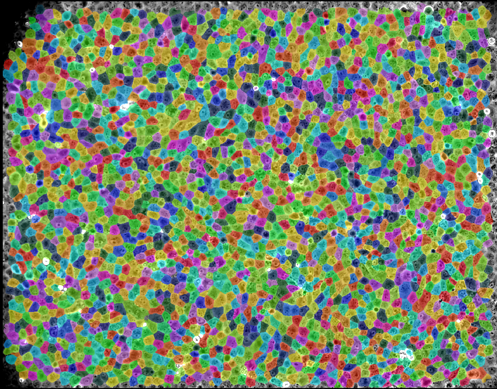

<!-- Improved compatibility of back to top link: See: https://github.com/othneildrew/Best-README-Template/pull/73 -->
<a name="readme-top"></a>


<!-- PROJECT LOGO -->
<br />
<div align="center">
  <a href="https://github.com/github_username/repo_name">
    
  </a>

<h3 align="center">CellSegmentationTracker</h3>

  <p align="center">
    A Python module intended to make cell segmentation, tracking and subsequent (mostly biophysical) statisticial analysis easy
    <br />
    <br />
    <a href="https://github.com/simonguld/CellSegmentationTracker.git">Report Bug</a>
    ·
    <a href="https://github.com/simonguld/CellSegmentationTracker.git">Request Feature</a>
  </p>
</div>


<!-- TABLE OF CONTENTS -->
<details>
  <summary>Table of Contents</summary>
  <ol>
    <li>
      <a href="#about-the-project">About The Project</a>
    <li>
      <a href="#getting-started">Getting Started</a>
      <ul>
        <li><a href="#prerequisites">Prerequisites</a></li>
        <li><a href="#installation">Installation</a></li>
      </ul>
    </li>
    <li><a href="#usage">Usage and Limitations</a></li>
    <ul>
        <li><a href="#usage">Usage</a></li>
        <li><a href="#limitations">Limitations</a></li>
      </ul>
    <li><a href="#pretrained-models">Pretrained Models</a></li>
    <li><a href="#documentation">Documentation</a></li>
    <ul>
        <li><a href="#parameters">Parameters</a></li>
        <li><a href="#attributes">Attributes</a></li>
      <li><a href="#methods">Methods</a></li>
      </ul>
    <li><a href="#contributing">Contributing</a></li>
    <li><a href="#license">License</a></li>
    <li><a href="#contact">Contact</a></li>
    <li><a href="#acknowledgments">Acknowledgments</a></li>
  </ol>
</details>


<!-- ABOUT THE PROJECT -->
## About The Project

This module is meant to ease, automate and improve the process of biological cell segmentation, tracking and subsequent (mostly biophysical) statistical analysis. It is being developed primarily as a tool for the biophysicists of the Niels Bohr Institute of the University of Copenhagen, but anyone is more than welcome to use it! It is based on the cell segmentation program <a align="left"><a href="https://www.cellpose.org/">Cellpose</a></a> and the Tracking program <a align="left"><a href="https://imagej.net/plugins/trackmate/">Trackmate</a></a>, without any of which this project would have been impossible. The purpose of the module is to do 3 things, which can be done together or separately:
1. Integrate the segmentation and tracking steps into an automated pipeline, and extend the Cellpose-TrackMate functionality so as to allow altering the Cellpose parameters 'flow threshold' and 'cell probability threshold' (which are fixed when using TrackMate). Varying these parameters lead to more flexible and in some cases more accurate segmentations.
2. Extract relevant information from the xml file produced in step 1 (or an xml file generated by using TrackMate), and calculate the vector velocities of each cell (which are not available in TrackMate). Collect and save this information as a dataframe
3. Provide functions for statistical analysis like e.g. functions for calculating summary statistics and average feature values against time, as well as functions for estimating and visualizing the density (or any other scalar) and velocity fields, the density fluctuations etc. Make it easy to save and plot results.

<p align="right">(<a href="#readme-top">back to top</a>)</p>


<!-- GETTING STARTED -->
## Getting Started

### Prerequisites
* Python 3.9 
* Java 8
* Jython 2.7
* Fiji 2.9, and the TrackMate-Cellpose extension
* Cellpose 2.0
* Anaconda
  
### Installation

1. Download and unpack the newest version of Fiji. Follow the instructions on https://imagej.net/software/fiji/downloads.
2. Download and install Java 8 here: https://www.oracle.com/java/technologies/downloads/#java8-windows
3. Download and install Jython. Follow the instructions on https://www.jython.org/installation.html
4. Install Anaconda or Miniconda, if you haven't already. Follow the instructions on https://docs.conda.io/en/latest/miniconda.html
5. Create an conda virtual environment using Python 3.9 (it might also work with python 3.8 and 3.10). Follow the instructions on https://pypi.org/project/cellpose/. If you have a GPU available, consider installing the gpu-version; it drastically increases the segmentation speed. 
6. Install the TrackMate extension Trackmate-Cellpose. To see how, visit: https://imagej.net/plugins/trackmate/detectors/trackmate-cellpose. Make sure to update it after installation.
7. From the cellpose virtual environment, install CellSegmentationTracker using the following command:

   ```
   python -m pip install git+https://github.com/simonguld/CellSegmentationTracker.git
   ```
8. Now you should be good to go!

<p align="right">(<a href="#readme-top">back to top</a>)</p>

<!-- USAGE AND LIMITATIONS -->
## Usage and Limitations

### Usage

As mentioned previously, this module can be used as a pipeline for cell segmentation and tracking with flexible parameter options, to generate csv files that include vector velocity data from an xml file, as well as an aid in the subsequent statistical analysis. It can be used for all or either of those purposes.

All functionality is contained in the class CellSegmentationTracker, which can be imported as follows:
```python
from cellsegmentationtracker import CellSegmentationTracker
```
To read about the parameters, attributes and methods of CellSegmentationTracker, go to <a align="left"><a href="#documentation">Documentation</a></a>. To see an example of how to use this module and its methods, take a look at the <a align="left"><a href="https://github.com/simonguld/CellSegmentationTracker/blob/main/example_notebook.ipynb">example notebook</a></a>.

### Limitations
  - As of now, only .tif files are supported as input images
  - As of now, only the TrackMate LAP tracker is supported. The LAP tracker is used in all cases (see https://imagej.net/plugins/trackmate/trackers/lap-trackers for more information)
  - As of now, it is not possible to apply tracking filters. Instead, the idea is to use a cell segmentation model that is sufficiently specialized to a given data set such that filtering is unnecessary. For more details on this, see <a align="left"><a href="#pretrained-models">Pretrained Models</a></a> below.

<p align="right">(<a href="#readme-top">back to top</a>)</p>

<!-- PRETRAINED MODELS -->
## Pretrained Models
The pretrained Cellpose models 'CYTO', 'CYTO2' and 'NUCLEI' are of course available when choosing a segmentation model. The user can choose between an additional three models: 'EPI500', 'EPI2500' and 'EPI6000', which have been created by tranfer learning of the Cellpose models, i.e. by training them on specific cell image types (and resolutions) to improve performance on these types of data. The name EPI stems from the fact that all models have been trained on epithelial cells, and the subsequent number indicates the approximate number of cells in an image. 

If none of the pretrained models suit your needs, you can train your own model using the Cellpose GUI - it is easy and can be done rather quickly.

### EPI 500:
_Example Image_
<br />
<div align="center">  <a href="https://github.com/github_username/repo_name">
    
  </a>
</div>

* Trained using the Cellpose model 'CYTO2' as starting point
* Trained on images of a monolayer of epithelial cells with roughly 500 cells per image
* It has been trained so as not not segment cells at the image boundary (to avoid partial segmentations)
* Images created using flourescence microscopy (5 min. between frames)
* Magnification: 40x
* Image size: 2560x2150 (416x351 microns)
* Default paramters for this model:
    * FLOW_THRESHOLD = 0.4
    * CELLPROB_THRESHOLD = 0.5
    * CELL_DIAMETER = 88.7 pixels

### EPI 2500:
_Example Image_
<br />
<div align="center">  <a href="https://github.com/github_username/repo_name">
    
  </a>
</div>

* Trained using the Cellpose model 'CYTO' as starting point
* Trained on images of a monolayer of epithelial cells, with roughly 2500 cells per image
* The bright white spots indicate an absence of cells and are not to be segmented
* It has been trained so as not not segment cells at the image boundary (to avoid partial segmentations)
* Images created using light microscopy (10 min. between frames)
* Magnification: 10x
* Image size: 2005x1567 (1303.25x1018.55 microns)
* Default paramters for this model:
    * FLOW_THRESHOLD = 0.6
    * CELLPROB_THRESHOLD = - 1.0
    * CELL_DIAMETER = 37.79 pixels

### EPI 6000:
_Example Image_
<br />
<div align="center">  <a href="https://github.com/github_username/repo_name">
    
  </a>
</div>

* Trained using the Cellpose model 'CYTO2' as starting point
* Trained on images of a monolayer of epithelial cells with roughly 6000 cells per image
* It has been trained so as not not segment cells at the image boundary (to avoid partial segmentations)
* Images created using light microscopy (187 seconds between frames)
* Magnification: 10x
* Image size: 2560x2160 (1664x1404 microns)
* Default paramters for this model:
    * FLOW_THRESHOLD = 0.5
    * CELLPROB_THRESHOLD = 0.0
    * CELL_DIAMETER = 30.58 pixels

<!-- DOCUMENTATION -->
## Documentation

### Class definition


```python
class CellSegmentationTracker.CellSegmentationTracker(self, cellpose_folder_path, imagej_filepath = None,
cellpose_python_filepath = None, image_folder_path = None, xml_path = None, output_folder_path = None,
use_model = 'CYTO', custom_model_path = None, show_segmentation = False, cellpose_dict = {}, trackmate_dict = {})
```


```python
 __init__(self, cellpose_folder_path, imagej_filepath = None, cellpose_python_filepath = None,
image_folder_path = None, xml_path = None, output_folder_path = None, use_model = 'CYTO',
custom_model_path = None, show_segmentation = False, cellpose_dict = {}, trackmate_dict = {})
```

#### **Parameters:**    
- **cellpose_folder_path: (str)**
  - The path to the folder containing the cellpose python package. It can be found in the virtual environment created for running cellpose. On windows, it typically found in ./path_to_anaconda_folder/envs/cellpose/Lib/site-packages/cellpose.
  On MAC, it is typically found in ./path_to_anaconda_folder/envs/cellpose/lib/python3.[insert version here]/site-packages/cellpose
- **imagej_filepath: (str, default=None)**
  - The file path to the ImageJ/Fiji executable. It can be found in the Fiji.app folder. If you want to use CellSegmentationTracker for segmentation and tracking, this parameter must be provided.
- **cellpose_python_filepath: (str, default=None)**
  - The file path to the Cellpose Python program. It can be found in the virtual environment created for running cellpose. If you want to use CellSegmentationTracker for segmentation and tracking, this parameter must be provided.
- **image_folder_path: (str, default=None)**
  - The path to the .tif input image or to the folder containing .tif input images for processing. If a folder is provided, CellSegmentationTracker will merge all images (leaving the originals intact) in this folder to a file called ./merged.tif and run analysis on this file. If not provided, an XML file must be provided instead, and the class methods can then be used for postprocess analysis and for csv file generation
- **xml_path: (str, default=None)**
  - If segmentation and tracking has already been carried out, the resulting TrackMate XML file can be provided, and the class methods
can be used for postprocess analysis
- **output_folder_path: (str, default=None)**
  - The folder where output files will be saved. If not specified, the image folder (if provided) will be used and otherwise the XML folder. Note that XML files generated by the class will always be output to the image folder
- **use_model: (str, default='CYTO')**
  - Specifies the Cellpose model to use for segmentation. Options include the Cellpose models 'CYTO', 'CYTO2', 'NUCLEI', as well the specialized models 'EPI500', 'EPI2500' and 'EPI6000'. For information on the specialized models, see <a align="left"><a href="#pretrained-models">Pretrained Models</a></a>
- **custom_model_path: (str, default=None)**
  - If a custom Cellpose model is to be used, provide the path to the model here.
- **show_segmentation (bool, default=True)**
  - Determines whether to open Fiji and display the segmentation results interactively during processing.
- **cellpose_dict:  (dict, default=dict())**
  - A dictionary containing additional parameters to pass to the Cellpose segmentation algorithm:
    - TARGET_CHANNEL (positive int, default = 0): What channel to use as the main channel for segmentation with cellpose. ‘0’ means that cellpose will run on a grayscale combination of all channels. ‘1’ stands for the first channel, corresponding to the red channel in a RGB image. Similarly for ‘2’ and ‘3’, the second and third channel, corresponding to the green and blue channels in a RGB image.
    - OPTIONAL_CHANNEL_2 (positive int, default = 0): The cyto and cyto2 pretrained models have been trained on images with a second channels in which the cell nuclei were labeled. It is used as a seed to make the detection of single cells more robust. It is optional and this parameter specifies in which channel are the nuclei (‘1’ to ‘3’). Use ‘0’ to skip using the second optional channel. For the nuclei model, this parameter is ignored.
    - CELL_DIAMETER (positive float, default = 0.0): Estimate of the cell diameter in the image, in pixel units. When set to 0.0, Cellpose automatically estimates the cell diameter. This is recommended, as Cellpose performs poorly when given an inacurrate cell diameter estimate.
    - USE_GPU (boolean, default = False)
    - SIMPLIFY_CONTOURS (boolean, default = True): If True the 2D contours detected will be simplified. If False, they will follow exactly the pixel borders.
    - FLOW_THRESHOLD (positive float): The maximum allowed error of the flows for each mask. Increase this threshold if cellpose is not returning as many ROIs as you’d expect. Similarly, decrease this threshold if cellpose is returning too many ill-shaped ROIs. The default value is 0.4 for the Cellpose models and 'EPI500'. For 'EPI2500', the default is 0.5.
    - CELLPROB_THRESHOLD (float in [-6, 6]): The pixels greater than the cellprob_threshold are used to run dynamics and determine ROIs. Decrease this threshold if cellpose is not returning as many ROIs as you’d expect. Similarly, increase this threshold if cellpose is returning too ROIs particularly from dim areas. The default is 0.0 for the cellpose models. For 'EPI500', the default is 0.5, and for 'EPI2500', the default is -1.0.
- **trackmate_dict: (dict, default=dict())**
  - A dictionary containing parameters for configuring the TrackMate LAPTracker. It has the following keys:
      - LINKING_MAX_DISTANCE (float, default = 15.0): The max distance between two consecutive spots, in physical units (if provided in .tif file, otherwise in pixel units), allowed for creating links.
      - GAP_CLOSING_MAX_DISTANCE (float, default = 15.0): Gap-closing max spatial distance. The max distance between two spots, in physical units (if provided in .tif file, otherwise in pixel units), allowed for creating links over missing detections. 
      - MAX_FRAME_GAP (positive int, default = 2): Gap-closing time-distance. The max difference in time-points between two spots to allow for linking. For instance a value of 2 means that the tracker will be able to make a link between a spot in frame t and a successor spots in frame t+2, effectively bridging over one missed detection in one frame. 
      - ALLOW_TRACK_MERGING (bool, default = False): If True then the tracker will perform tracklets or segments merging, that is: have two or more tracklet endings linking to one tracklet beginning. This leads to tracks possibly fusing together across time.    
```NB```: Setting this to true makes it possible for several cells belonging to the same track to be present at the same time, which can lead to inaccurate velocity estimations.
      - ALLOW_TRACK_SPLITTING (bool, default = False): If True then the tracker will perform tracklets or segments splitting, that is: have one tracklet ending linking to two or more tracklet beginnings . This leads to tracks possibly separating into several sub-tracks across time, like in cell division.      
```NB```: Setting this to true makes it possible for several cells belonging to the same track to be present at the same time, which can lead to inaccurate velocity estimations.

**Attributes:**
- **img_folder: (str)** - The path to the .tif input image folder containing, if provided
- **xml_path: (str)** - The path to the TrackMate XML file, if provided. If generated, it will be saved in the image folder
- **output_folder: (str)** - The path to the folder where output files will be saved.
- **cellpose_dict: (dict)** - A dictionary containing the parameters passed to the Cellpose segmentation algorithm
- **trackmate_dict: (dict)** - A dictionary containing the parameters passed to the TrackMate LAPTracker
- **cellpose_default_values: (dict)** - A dictionary containing the default values for the parameters passed to the Cellpose segmentation algorithm
- **trackmate_default_values: (dict)** - A dictionary containing the default values for the parameters passed to the TrackMate LAPTracker  
- **pretrained_models: (list)** - A list of the pretrained Cellpose models available for segmentation
- **spots_df: (pandas.DataFrame)** - A dataframe containing the spot data from the TrackMate XML file
- **tracks_df: (pandas.DataFrame)** - A dataframe containing the track data from the TrackMate XML file
- **edges_df: (pandas.DataFrame)** - A dataframe containing the edge data from the TrackMate XML file
- **grid_df: (pandas.DataFrame)** - A dataframe containing the grid data, if generated
    


**Methods:**

List of methods:
```python
run_segmentation_tracking
generate_csv_files
get_summary_statistics
lot_feature_over_time
calculate_grid_statistics
visualize_grid_statistics
plot_velocity_field
get_feature_keys
print_settings
```

```python
run_segmentation_tracking()
```
Run cellpose segmentation and trackmate tracking.


```python
generate_csv_files(calculate_velocities = True, get_tracks = True, 
                           get_edges = True, save_csv_files = True, name = None)
```
Generate spot, track and edge dataframes from xml file, with the option of saving them to csv files.

Parameters:
- **calculate_velocities : (bool, default = True)**
    - whether to calculate velocities from trackmate data and
                                include them in the spots csv file
- **get_tracks : (bool, default = True)**
    - whether to generate a dataframe with track features
- **get_edges : (bool, default = True)**
    - whether to generate a dataframe with edge features
- **save_csv_files : (bool, default = True)**
    - whether to save the csv files to the output folder
- **name : (str, default = None)**
    - name of csv files. If None, the name of the image file is used.

```python
get_summary_statistics()
```
Calculate average values of observables for spot, track and edges observables


```python
plot_feature_over_time(spot_feature = 'Area')
```
Plots the average values of a feature over time.

Parameters:
- **spot_feature : (str, default = 'Area')**
    - Name of spot feature to plot.


```python
calculate_grid_statistics(Ngrid, include_features = [], return_absolute_cell_counts = False,
                               save_csv = True, name = None)
```
Generate spot, track and edge dataframes from xml file, with the option of saving them to csv files.

Parameters:
- **Ngrid: (int > 0)**
    - number of grid squares in the smallest dimension. The number of grid squares in the other dimension is determined by the aspect ratio of the image, 
                with the restriction that the grid squares are square.
- **include_features : (list of strings, default = [])**
    - list of features to include in the grid dataframe, 
                            in addition to the standard features number_density, mean_velocity_X and mean_velocity_Y.
                            The possible feature keys are the columns of the spots dataframe generated 
                            by the function 'generate_csv_files'.
- **return_absolute_cell_counts : (bool, default = False)**
    - if True, the number of cells in each grid square
                                      is returned instead of the density.
- ** save_csv : (bool, default=True)**
    - if True, the grid dataframe is saved as a csv file.
- **name : (string, default = None)**
    - name of the csv file. If None, the name of the image file is used. It will be saved in the output_folder, if provided, 
                                     otherwise in the image folder


```python
visualize_grid_statistics(feature = 'number_density', frame_range = [0,0], calculate_average = False, \
                             animate = True, frame_interval = 1200, show = True)
```
Visualize the grid statistics (generated by the method calculate_grid_statistics) for a given feature 
        in the form of a heatmap.

Parameters:
- **feature : (string, default = 'number_density')**
    - feature to visualize. Must be a column of the grid dataframe \
                  generated by the method calculate_grid_statistics.
- **frame_range : (list of ints, default=[0,0])**
    - range of frames to visualize. Left endpoint is included, right endpoint is not.
                      If [0,0], all frames are visualized.
- ** calculate_average : (bool, default=False)**
    - if True, the average heatmap over the given frame range 
                            is calculated and visualized.
- ** animate : (bool, default=True))**
    - if True, the heatmap is animated over the given frame range.
- **frame_interval : (int, default=1200)**
    - time between frames in ms (for the animation).
- **show : (bool, default=True)**
    - of True, the figures are shown


```python
plot_velocity_field(mode = 'field', frame_range = [0,0], calculate_average = False, \
                                animate = True, frame_interval = 1200, show = True)
```
Plot or animate the velocity field for a given frame range.

Parameters:
- **mode : (string, default = 'field_lines')**
    - mode of visualization. Can be 'field' or 'streamlines'
- **frame_range : (list of ints, default=[0,0])**
    - range of frames to visualize. Left endpoint is included, right endpoint is not.
                      If [0,0], all frames are visualized.
- ** calculate_average : (bool, default=False)**
    - if True, the average heatmap over the given frame range 
                            is calculated and visualized.
- ** animate : (bool, default=True))**
    - if True, the heatmap is animated over the given frame range.
- **frame_interval : (int, default=1200)**
    - time between frames in ms (for the animation).
- **show : (bool, default=True)**
    - of True, the figures are shown


```python
get_feature_keys()
```
Get the keys of the features in the csv files.

```python
print_settings()
```
Print the settings used for cellpose segmentation and trackmate tracking, as well as some
        basic image information.


<!-- CONTRIBUTING -->
## Contributing

Contributions are what make the open source community such an amazing place to learn, inspire, and create. Any contributions you make are **greatly appreciated**.

If you have a suggestion that would make this better, please fork the repo and create a pull request. You can also simply open an issue with the tag "enhancement".
Don't forget to give the project a star! Thanks again!

1. Fork the Project
2. Create your Feature Branch (`git checkout -b feature/AmazingFeature`)
3. Commit your Changes (`git commit -m 'Add some AmazingFeature'`)
4. Push to the Branch (`git push origin feature/AmazingFeature`)
5. Open a Pull Request

<p align="right">(<a href="#readme-top">back to top</a>)</p>


<!-- LICENSE -->
## License

Distributed under the MIT License. See `LICENSE` for more information.

<p align="right">(<a href="#readme-top">back to top</a>)</p>


<!-- CONTACT -->
## Contact
Simon Guldager Andersen - guldager.simon@gmail.com

Project Link: [https://github.com/simonguld/CellSegmentationTracker.git](https://github.com/simonguld/CellSegmentationTracker.git)

<p align="right">(<a href="#readme-top">back to top</a>)</p>


<!-- ACKNOWLEDGMENTS -->
## Acknowledgments
* <a align="left"><a href="https://nbi.ku.dk/english/staff/?pure=en/persons/654165">Asst. Prof. Amin Doostmohammadi, University of Copenhagen,</a></a> for conceiving the idea for this project, and for providing me with guidance and valuable insights along the way.
* <a align="left"><a href="https://nbi.ku.dk/english/staff/?pure=en/persons/387701">Asst. Prof. Natascha Leijnse, University of Copenhagen,</a></a> for testing the module, providing data to train the models, and for illuminating which methods and features would be useful for biophysicists working with this kind of data. 
* <a align="left"><a href="https://nbi.ku.dk/english/staff/?pure=en/persons/760892">Ph.d. Fellow Valeriia Grudtsyna, University of Copenhagen,</a></a> for for testing the module, providing data to train the models, and for illuminating which methods and features would be useful for biophysicists working with this kind of data. 
* <a align="left"><a href="https://forskning.ku.dk/soeg/result/?pure=da%2Fpersons%2Fmari-tolonen(07bd9ae5-3531-4e88-9259-e67ef38856b8).html">Ph.d. Fellow Mari Tolonen, University of Copenhagen, </a></a> for providing valuable advice on tracking and segmentation in general.

<p align="right">(<a href="#readme-top">back to top</a>)</p>


